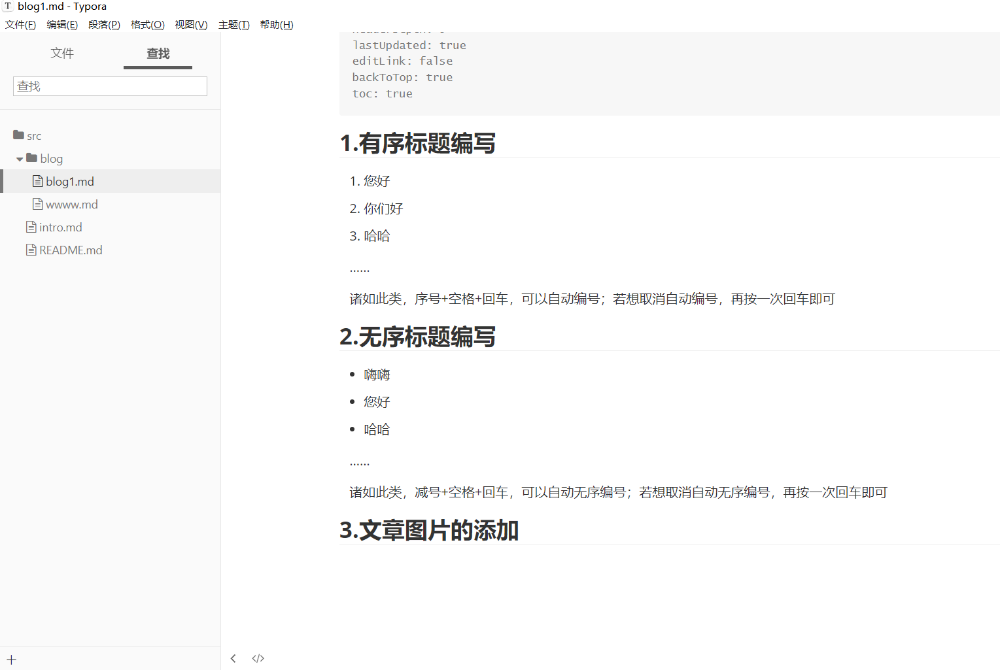

## 1.有序标题编写

1. 您好
2. 你们好
3. 哈哈

   ……

   诸如此类，序号+空格+回车，可以自动编号；若想取消自动编号，再按一次回车即可

## 2.无序标题编写

- 嗨嗨
- 您好
- 哈哈

   ……

   诸如此类，减号+空格+回车，可以自动无序编号；若想取消自动无序编号，再按一次回车即可

## 3.文章图片的添加



- 图片的添加就是“复制+粘贴”

## 4.代码的添加

```python
print("hello world")
```

- 英文输入法下“1”旁边的按键，三下，出现三个点“```”，然后再打python即可

## 5.如何弄清单可选项

- [x] 今天学习文章编写
- [ ] 。。。。。。

- 可选项的出现方法：”减号（-）+中括号（[]）+小写x”即可，取消自动编号的方法同上

## 6.表格的制作

| 姓名 | 班级   | 年龄 |
| ---- | ------ | :--- |
| yyh  | 无敌班 | 0岁  |

- 表格的出现方法：“|xxx|xxx|xxx|”

## 7.文章中放链接的方法

- 法一：`[链接名字](放链接)`    [链接名字](放链接)

- 法二：`[放链接](放链接)`        [放链接](放链接)
- 法一呈现：[Mr.dun的网站](https://scarlettdun.com/)
- 法二呈现：[https://scarlettdun.com/](https://scarlettdun.com/)
- tip：如果不想法一or法二中的内容显示最终的效果，在文字内容前后各打一个点，即英文输入法状态下的破折号按键   “``”